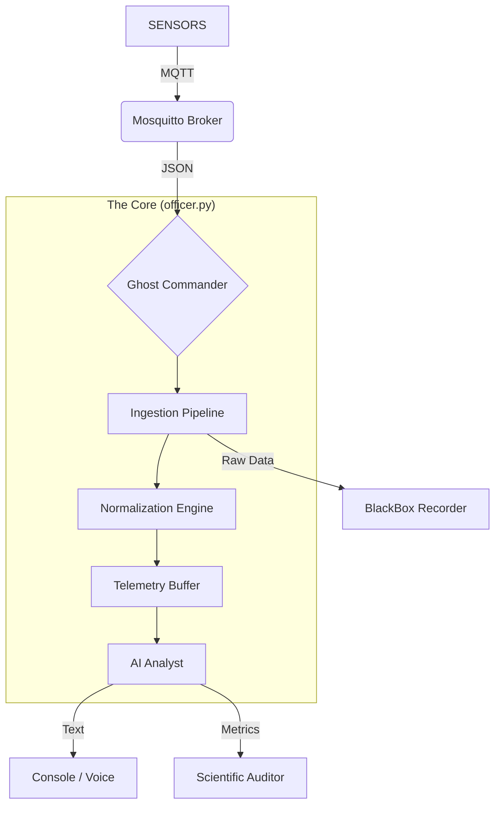

# 🏗️ System Architecture: SecuringSkies Platform

**Version:** 1.0.3
**Status:** Production
**Pattern:** Event-Driven Micro-Kernel (Ghost Commander)

## 1. High-Level Design
The platform uses a **Centralized Logic Unit** ("The Officer") to ingest heterogeneous telemetry streams via MQTT, normalize them into a unified operational picture, and use a Large Language Model (LLM) to generate semantic situation reports.

## 2. Core Components

### 🧠 The Brain (`core/officer.py`)
The monolithic logic unit that replaced the legacy `drivers/` architecture to minimize latency (<100ms).
* **Ingestion:** Listens to `dronetag/#`, `owntracks/#`, and `thing/product/#`.
* **Normalization:** Maps proprietary fields (e.g., Autel `capacity_percent`) to a standard schema (`batt`).
* **Semantic Labeling:** Explicitly tags assets as `Ground Station (GCS)` or `UAV` to prevent AI hallucinations.
* **Constitutional Guardrails:** Regex-based rules that override LLM outputs to enforce safety terminology.

### 📡 The Nervous System (MQTT)
All inter-process communication happens over MQTT (TCP/8883 for TLS).
* **QoS:** Level 0 (Fire and Forget) for maximum speed.
* **Latency KPIs:**
    * **Dronetag:** Calculated via ISO 8601 timestamp parsing (Glass-to-Glass).
    * **Autel:** Calculated via Controller Heartbeat `sn` topic (Ground-to-Cloud).

### 🧪 Scientific Auditor (`outputs/auditor.py`)
A parallel thread that grades the AI's performance in real-time.
* **Factuality Score:** Checks if reported battery levels match raw telemetry.
* **Safety Score:** Detects hazardous advice (e.g., "Look at the drone while driving").
* **Latency:** Measures `End-to-End Inference Time`.

## 3. Data Flow

1.  **Ingest:** Raw JSON arrives from MQTT.
2.  **Decode:** `officer.process_traffic()` determines the protocol (Autel vs ASTM F3411).
3.  **KPI Calc:** Latency is calculated immediately: $T_{server} - T_{device}$.
4.  **Buffer:** Data is stored in `self.telemetry_buffer` (Key-Value Store).
5.  **Reason:** Every 45s, `generate_sitrep()` flattens the buffer into a prompt.
6.  **Guardrail:** The System Prompt applies "Constitutional Rules" to the Context.
7.  **Inference:** Llama 3.1 (or GPT-4o) generates the textual report.
8.  **Audit:** The generated text is compared against the Buffer for accuracy.

## 4. Security & Safety
* **Encryption:** Full TLS 1.2+ support for Cloud Bridge (`mqtt.securingskies.eu`).
* **Identity:** Username/Password authentication required for all nodes.
* **Fail-Safe:** If the AI hallucinates, the `raw_telemetry` is preserved in `logs/mission_*.jsonl` for forensic reconstruction.
