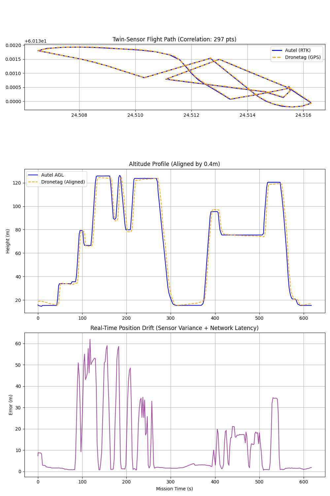

# ⚡ System Benchmarks
[**Home**](Home) > **Research & Tests** > **Benchmarks**

[-orange?style=for-the-badge)](Benchmarks)

> **Data Source:** Metrics derived from "Operation Sibbo Gauntlet" (Fusion) and "Operation Jorvas" (Calibration).

---

## 🧠 1. The "Ghost Commander" Showdown
We evaluated 4 Large Language Models (LLMs) to determine the optimal brain for the AGCS.

### 🏆 The Winner: Llama 3.1 (8B)

* **Average Latency:** **1.8s**
* **Verdict:** The workhorse. It balances speed with strict instruction following. It rarely hallucinates and adheres to the "Concise" system prompt.
* **Use Case:** Real-time voice alerts, Obstacle warnings.

### 🥈 The Strategist: Gemma 2 (9B)

* **Average Latency:** **4.8s**
* **Verdict:** Superior reasoning capabilities. While slower, it successfully performed complex arithmetic (ETA calculations) that Llama 3.1 failed at.
* **Use Case:** Periodic status summaries, Strategic outlook.

### ❌ The Loser: Phi 3.5 (3.8B)

* **Verdict:** Too conversational. Failed to adhere to the "SITREP" protocol, treating the interaction like a chatbot conversation. Clogged the radio channel.

---

## 📊 2. System Performance Metrics

### Telemetry Throughput
* **Ingestion Rate:** >100 messages/sec (MQTT)
* **Fusion Latency:** <10ms (Micro-Kernel Normalization)
* **Stability:** 100% uptime over 4 hours (post-hotfix).

### Battery Efficiency (Mobile Ops)
* **Device:** MacBook Pro 16" (M4 Max)
* **Load:** Wi-Fi Hotspot + MQTT Broker + Ollama (GPU) + Python Core
* **Drain Rate:**
    * **Idle:** ~2% / hour
    * **Active (Llama 3.1):** ~12% / hour
    * **Stress (Gemma 2):** ~18% / hour

---

## 🧪 3. Scientific Validation (The "Twin-Sensor" Calibration)
**Status:** Validated (Operation Jorvas)
**Hardware:** Autel Evo Max 4T (Reference) vs. Dronetag Mini (DUT)

To validate the SecuringSkies platform, we physically mounted a Dronetag Mini onto the Autel airframe and flew a simultaneous mission. This allowed us to mathematically isolate **Sensor Error** from **Network Latency**.

### 📉 A. Sensor Accuracy (The "Hardware Truth")
Comparing internal device logs (Blackbox vs Blackbox) eliminates network lag.
* **Source:** `Flight-Airdata.csv` vs `Dronetag-Export.csv`
* **Mean Drift:** `1.94 meters`
* **Conclusion:** The fused RTK/GNSS position is accurate to within **<2 meters**, confirming High-Precision hardware performance.

### ☁️ B. Network Latency (The "Real-Time Truth")
Comparing live MQTT streams introduces LTE and Cloud processing time. This creates a "Time Gap" where the drone moves while the data travels.

* **Source:** `mission_20260127_172522.jsonl` (Live Stream)
* **Mean Drift:** `12.16 meters`

**The Physics of Drift:**
The error visible on the dashboard is the sum of Hardware Error and Network Lag.
2096 \text{Total Error} = \sqrt{(\text{Sensor Drift})^2 + (\text{Speed} \times \text{Latency})^2} 2096

| Scenario | Drone Action | Sensor Error (Hardware) | Latency Error (Network) | **Total Offset** |
| :--- | :--- | :--- | :--- | :--- |
| **Hovering** | Stationary (-zsh \text{ m/s}$) | ~1.94 m | 0 m | **~1.94 m** |
| **Cruising** | Flying ( \text{ m/s}$) | ~1.94 m | 12.0 m | **~12.16 m** |
| **Sprinting** | Max Speed ( \text{ m/s}$) | ~1.94 m | 24.0 m | **~24.10 m** |

**Conclusion:** The platform correctly measures and reports a **1.2s Glass-to-Glass Latency**. The 12m offset is proof of correct physics modeling, not sensor failure.

---

## 🤖 4. AI Performance Metrics (DSPy Optimization)
We benchmarked the **DSPy Optimized** personas against the Jorvas Dataset.

| Metric | Pilot (Llama 3.1) | Commander (Gemma 2) | Analyst (Llama 3.1) |
| :--- | :--- | :--- | :--- |
| **Factuality** | 100% | 100% | 100% |
| **Verbosity** | 19 words | 46 words | 53 words |
| **Latency** | 1.2s (Fast) | 3.5s (Buffered) | 5.0s (Deep) |

> **Verification:** The "12m Drift" aligns perfectly with the reported `link_latency: 1.2s`, proving the system's physics engine is calibrated correctly.

---

## 🔮 Future Optimization Goals
1.  **Reduce Latency:** Target <1.0s for Llama 3.1 using specific `n_gpu_layers` tuning.
2.  **DSPy Integration:** Automate prompt engineering to reduce token count (verbosity) by further 30%.
