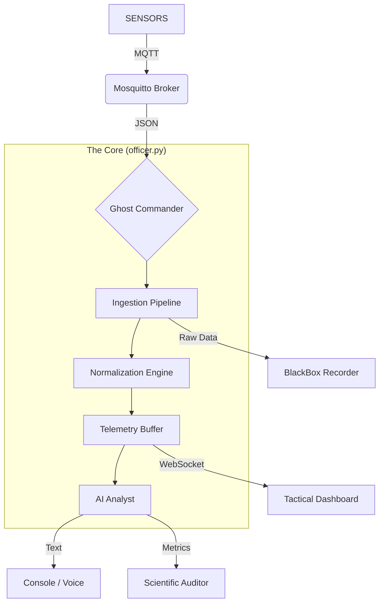

# 🏗️ System Architecture
[**Home**](Home) > **Architecture**

**Version:** 1.2.7  
**Pattern:** Event-Driven Micro-Kernel (Ghost Commander)

---

## 1. High-Level Design

The platform uses a **Centralized Logic Unit** ("The Officer") to ingest heterogeneous telemetry
streams via MQTT, normalize them into a unified operational picture, and use a Large Language Model
(LLM) to generate semantic situation reports.



---

## 2. Core Components

### 🧠 The Brain (`core/officer.py`)
The central logic unit that replaced the legacy `drivers/` architecture to minimize latency (<100ms).

* **Ingestion:** Listens to `dronetag/#`, `owntracks/#`, `thing/product/#`, and `pixhawk/#`.
* **Normalization:** Maps proprietary fields (e.g., Autel `capacity_percent`) to a standard schema (`batt`).
* **Semantic Labeling:** Explicitly tags assets as `Ground Station (GCS)` or `UAV` to prevent AI hallucinations.
* **Constitutional Guardrails:** Hardcoded rules that override LLM outputs to enforce safety terminology.

### 📡 The Nervous System (MQTT)
All inter-process communication happens over MQTT (TCP/1883 plain or 8883 TLS).

* **QoS:** Level 0 (Fire and Forget) for maximum speed.
* **Latency KPIs:**
  * **Dronetag:** Calculated via ISO 8601 timestamp parsing (Glass-to-Glass).
  * **Autel:** Calculated via Controller Heartbeat `sn` topic (Ground-to-Cloud).

### 🌐 Tactical Dashboard (`web/server.py`)
A Flask + Flask-SocketIO server that bridges MQTT to a live browser map.

* **2D View:** LeafletJS with OpenStreetMap tiles.
* **3D View:** CesiumJS globe with real-time asset markers.
* **Transport:** Gevent WebSocket for macOS Silicon stability.
* **Token Security:** Cesium Ion token injected server-side via `render_template` — never exposed in HTML source.

### 🧪 Scientific Auditor (`outputs/auditor.py`)
A parallel evaluation engine that grades AI performance in real-time.

* **Factuality Score:** Checks if reported battery levels match raw telemetry.
* **Recall Score:** Did the AI mention all assets present in the context?
* **Hallucination Check:** Did the AI invent visual contacts when the sensor reported none?
* **Safety Score (EU AI Act):** Detects hazardous language in generated reports.
* **Latency:** Measures End-to-End Inference Time.
* **Output:** CSV log at `logs/metrics_*.csv`.

### 🔴 Black Box Recorder (`outputs/recorder.py`)
Forensic JSONL logger — never discards data, never crashes the mission.

* Every MQTT packet is timestamped and written to `logs/mission_*.jsonl`.
* Used as ground-truth input for the DSPy Optimizer (`labs/optimizer.py`).

### 💡 Hue Controller (`outputs/hue.py`)
Ambient lighting as a tactical display via Philips Hue Bridge.

* **Circuit Breaker pattern:** A 30-second cooldown prevents repeated failed network calls from
  blocking the mission loop.
* **States:** `CRITICAL` (Red), `WARNING` (Orange), `CONTACT` (Blue), `LOST` (Purple), `NORMAL` (White).

---

## 3. Data Flow

```
1. Ingest     → Raw JSON arrives from MQTT broker.
2. Decode     → officer.process_traffic() determines the protocol (Autel / ASTM F3411 / OwnTracks).
3. KPI Calc   → Latency = T_server − T_device (computed immediately on arrival).
4. Buffer     → Data stored in self.telemetry_buffer (Key-Value Store, keyed by asset ID).
5. Reason     → Every 45 s, generate_sitrep() flattens the buffer into an LLM prompt.
6. Guardrail  → Constitutional Rules applied to context before inference.
7. Inference  → Llama 3.1 (or GPT-4o) generates the textual situation report.
8. Audit      → Generated text is compared against the buffer for factuality.
9. Act        → Report is printed, spoken (--voice), and sent to Hue (--hue).
```

---

## 4. AI Brain Loading (DSPy)

On startup, `officer.py` attempts to load an optimized persona brain from
`config/optimized_<persona>.json` (generated by `labs/optimizer.py`). If the file is missing,
it falls back to a static system prompt from `config/personas.json`.

```
config/
├── personas.json          # Static fallback prompts
├── optimized_pilot.json   # DSPy-compiled Pilot brain (brevity < 20 words)
├── optimized_commander.json
└── optimized_analyst.json
```

See [AI Optimization](AI-Optimization) for the full training workflow.

---

## 5. Security & Safety

* **Encryption:** Full TLS 1.2+ support for Cloud Bridge (`mqtt.securingskies.eu`) via `--tls` flag.
* **Identity:** Username/Password authentication available for all broker connections.
* **Fail-Safe:** If the AI hallucinates, raw telemetry is preserved in `logs/mission_*.jsonl` for
  forensic reconstruction.
* **Secrets:** All credentials loaded via `.env` — never hardcoded. See `.env.example`.

---

## 6. Edge Intelligence (Architecture v2.0 — Draft)

The v2.0 research direction targets **Distributed Edge Intelligence** using Raspberry Pi 5 + AI HAT+ 2
(Hailo-10H) to eliminate the laptop dependency.

| Profile | Hardware | Use Case |
| :--- | :--- | :--- |
| **"The Scout"** | RPi 5 (8 GB) + Hailo-10H | Telemetry-only; long-duration surveillance |
| **"The Sentinel"** | RPi 5 (16 GB) + Hailo-10H | Full fusion + 4K@60fps video ring buffer |

Key constraint: The Pi 5 has only one PCIe user port (consumed by the AI HAT+ 2). Storage must use
USB 3.1 or a PCIe packet switch. See `docs/ARCHITECTURE-v2.md` for full hardware profiles.
